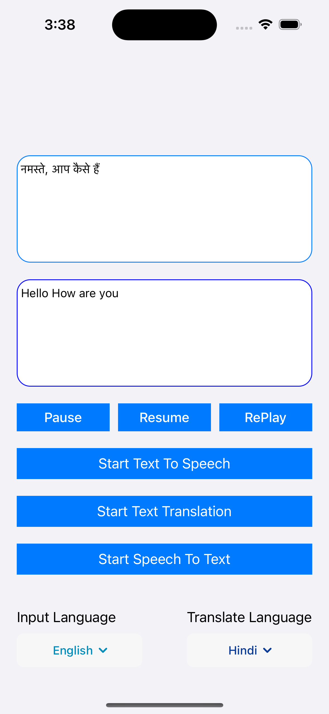

# JioTranslateCoreSDK_iOS
JioTranslate CoreSDK iOS Demo App

# JioTranslate CoreSDK Quickstart

## Table of Contents

1. [Introduction](#introduction)
2. [Features](#features)
3. [Prerequisites](#prerequisites)
4. [Project Settings](#project-settings)
5. [Integration Steps](#integration-steps)
   - [Add SDK](#add-sdk)
   - [Import SDK](#import-sdk)
   - [Integrate SDK](#integrate-sdk)
   - [Load Configuration](#load-configuration)
   - [Speech to Text Translation](#speech-to-text-translation)
   - [Text to Text Translation](#text-to-text-translation)
   - [Text to Speech Translation](#text-to-speech-translation)

## Introduction

In this documentation, we'll guide you through the process of installation, Let's get started on your journey to Break Language barriers with translation of any language into your native tongue with JioTranslate CoreSDK!



---

## Features

In JioTranslate Core SDK, you'll find a range of powerful features designed to enhance your iOS application's translation needs. These features include:

1. **Speech to Text Translation**: Experience seamless conversion of spoken language into written text.

2. **Text to Text Translation**: Effortlessly translate text from one language to another.

3. **Text to Speech Translation**: Transform written text into spoken language.

## Prerequisites

Before getting started with this example app, please ensure you have the following software installed on your machine:

- Xcode 14.2 or later.
- Swift 5.0 or later.
- An iOS device or emulator running iOS 13.0 or later.

## Project Settings

### Info.plist Changes

Please add below permissions keys to your `Info.plist` file with proper description.

```swift
<key>NSMicrophoneUsageDescription</key>
<string>App needs microphone access to record your audio and translate</string>
```

### Add SDK

Please add below pod to your Podfile and run command `pod install --repo-update --verbose`.

```ruby
pod 'JioTranslateCoreSDKiOS', '1.0.0-alpha.5'
```

### Import SDK

Please use below import statements

```swift
import JioTranslateCoreSDKiOS
```

### Integrate SDK

Create and configure the instance of `JioTranslateManager`. 

```swift
JioTranslateManager.shared.configure(server: .sit, jwt: jwt, userId: userId)
```

| Property Name | Type  | Description  |
| ------- | --- | --- |
| server | JioTranslateServer | Server address, .sit or .prod |
| jwt | String | JWT token |
| userId | String | Unique id of the User |

### Load Configuration
This method fetches the configuration data required for the SDK to function properly, upon successful loading, the list of supported languages can be obtained.
```swift
public func loadConfig(completion: @escaping (Result<String, CustomError>) -> Void)
```

| Property Name | Type  | Description  |
| ------- | --- | --- |
| completion | Result<String, CustomError> | .success(_), .failure(let error) |

### Speech to Text Translation

Use this function to convert spoken language into written text.

```swift
    public func startSpeechToText(audioFilePath: URL, inputLanguage: SupportedLanguage, translateEngine: TranlsateEngine? = nil, completion: @escaping (Result<String, CustomError>) -> Void)
```

| Property Name | Type  | Description  |
| ------- | --- | --- |
| audioFilePath | URL | Send recorded audio file path URL(Ex: recorded.wav) |
| inputLanguage | SupportedLanguage | Language name of the recorded audio, Ex: 'English', 'Telugu' |
| translateEngine | TranlsateEngine | .engine1, .engine2, .engine3 |
| completion | Result<String, CustomError> | .success(let text), .failure(let error) |

### Text to Text Translation

Use this function to translate text from one language to another.

```swift
    public func startTextTranslation(inputText: String, inputLanguage: SupportedLanguage, translationLanguage: SupportedLanguage, translateEngine: TranlsateEngine? = nil, isIndirectTranslation: Bool = false, completion: @escaping (Result<String, CustomError>) -> Void) 
```

| Property Name | Type  | Description  |
| ------- | --- | --- |
| inputText | String | Input text to translate |
| inputLanguage | SupportedLanguage | Language name of the input text, Ex: 'English', 'Telugu' |
| translationLanguage | SupportedLanguage | Language name of the output translation text, Ex: 'Hindi', 'Telugu' |
| translateEngine | TranlsateEngine | .engine1, .engine2, .engine3 |
| isIndirectTranslation | Bool | true or false |
| completion | Result<String, CustomError> | .success(let text), .failure(let error) |


### Text to Speech Translation

Use this function to translate written text into spoken language.

```swift
    public func startTextToSpeech(inputText: String, inputLanguage: SupportedLanguage, translateEngine: TranlsateEngine? = nil, gender: Gender, completion: @escaping (Result<String, CustomError>) -> Void)
```

| Property Name | Type  | Description  |
| ------- | --- | --- |
| inputText | String | Input text to translate |
| inputLanguage | SupportedLanguage | Language name of the input text, Ex: 'English', 'Telugu' |
| translateEngine | TranlsateEngine | .engine1, .engine2, .engine3 |
| gender | String | 'male' or 'female' |
| completion | Result<String, CustomError> | .success(let audioContent), .failure(let error) |

## Troubleshooting

Facing any issues while integrating or installing the JioTranalte iOS CoreSDK kit, please connect with us via real time support present in JioTranslate.AppSupport@jio.com or https://translate.jio/contact-us.html
